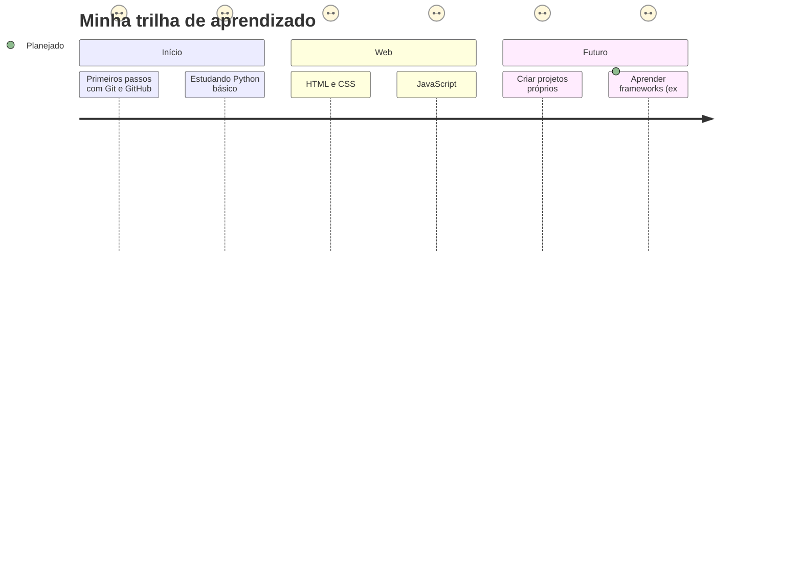

<h1 align="center">👋 Olá! Eu sou o André Nogueira</h1>

  🚀 Assistente de TI em formação  
  📚 Apaixonado por tecnologia e aprendendo todos os dias  
  💡 Explorando o mundo da programação e desenvolvimento web

---

### 💻 Atualmente Estudando

---

### 📈 GitHub Stats

  
  

---

### 🛠️ Projetos em construção

- 📄 Meu primeiro portfólio com HTML e CSS
- 📊 Automatizações simples com Python
- 🌐 Página interativa usando JavaScript
- ⏳ Contribuições futuras em repositórios abertos

---

### 🧭 Minha Jornada de Aprendizado

---- 

